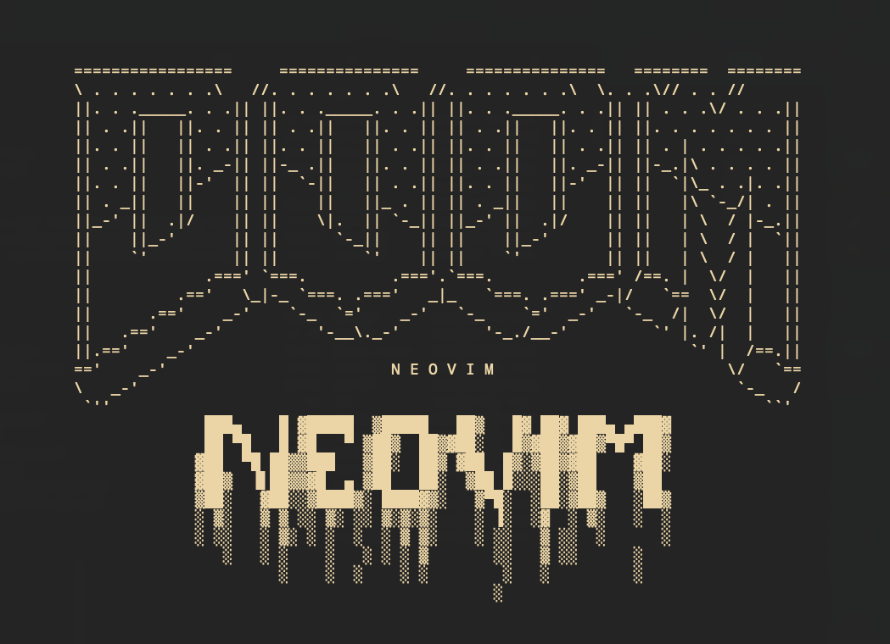

Banner.nvim
====

A light weight neovim greeter less than 200 lines.



## Quickstart

```lua
{
    "squarejellyfish/banner.nvim",
    config = function ()
        require("banner").setup()
    end
}
```

This project is for my personal use, customization is not supported for now.
